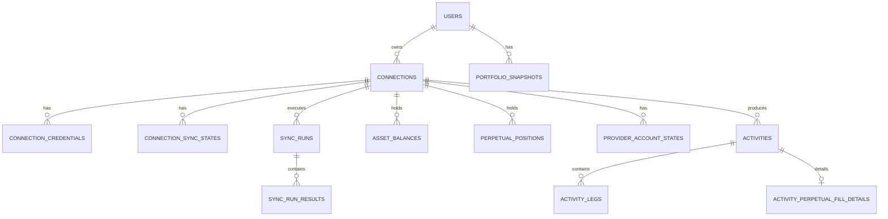

# Crypto Portfolio Hub データベース設計

文書ステータス: Draft
対象: MVPデータベース設計
DBMS: PostgreSQL

関連文書:

- [requirements.md](./requirements.md)
- [screen-design.md](./screen-design.md)
- [development-guidelines.md](./development-guidelines.md)

---

## 1. この文書の目的

本書は、Crypto Portfolio Hub のMVPで使用するPostgreSQLのデータモデル、永続化範囲、制約、Index、同期状態、履歴保持方針を定義する。

対象は以下である。

- Google認証ユーザー
- bitbank / Solana Wallet Address / Hyperliquid のConnection
- Connection Credential
- 現在の現物残高
- 現在のPerpetual Position
- Provider Account状態
- Activity Header / Activity Legs
- Perpetual FillのActivity Detail
- Connection単位の同期状態・同期履歴
- Portfolio履歴チャート用Snapshot

本書ではJava Entity、Repository、Flyway SQL、REST APIは実装しない。

Provider固有APIの詳細が未確認である部分は推測せず、`要Provider仕様確認` として残す。

---

## 2. 基本設計方針

### 2.1 Current State と History を分離する

MVPでは、データを大きく次の2種類に分ける。

**Current State**

- Asset Balance
- Perpetual Position
- Provider Account State
- Connection Sync State

現在のPortfolio表示に使用する。

同一Connectionの同期が成功した場合、新しい状態へ更新する。

同期が失敗した場合は既存の成功データを削除せず、前回値をstale dataとして保持する。

**History**

- Activity
- Sync Run
- Portfolio Snapshot

過去の状態・イベントとして蓄積する。

Current Stateの更新によって削除しない。

---

### 2.2 Portfolio集計結果を通常テーブルとして重複保存しない

以下は原則としてApplication Serviceで計算する。

- Net Worth
- Holdings Value
- Directional Value
- Stablecoin Value
- Market Exposure
- Position Value
- Exposure Ratio
- Unrealized PnLのJPY換算値

ただし、履歴チャートに必要なPortfolio集計値は `portfolio_snapshots` に保存する。

Current Stateと同じ値を「Dashboard用テーブル」として別途複製しない。

---

### 2.3 Provider失敗時に既存データを失わない

例えばHyperliquidの同期で、

- Balance: 成功
- Position: 成功
- Activity: 失敗

となった場合、

BalanceとPositionは更新するが、Activityは前回成功時の状態を保持する。

そのため同期状態はConnection全体だけでなく、Capability単位でも管理する。

CapabilityはMVPでは以下を想定する。

- `BALANCE`
- `POSITION`
- `ACTIVITY`
- `ACCOUNT`

Providerが対応しないCapabilityは同期対象にしない。

---

### 2.4 Provider固有データをDB Schema全体へ広げない

bitbank / Solana / Hyperliquid固有のレスポンス形式を、そのままDB Schemaへコピーしない。

Provider Adapterで共通モデルへ正規化してから保存する。

ただしProvider固有の識別子は、重複排除や追跡のため必要な範囲で保持する。

---

## 3. 永続化対象

| Data | Persistence | 方針 |
| --- | --- | --- |
| User | 永続化 | Google認証ユーザーを内部Userへ紐付ける |
| Connection | 永続化 | UserとProvider接続の所有関係 |
| Credential | 永続化 | 必要なProviderのみ暗号化して保存 |
| Connection Sync State | 永続化 | Capabilityごとの現在の同期状態 |
| Sync Run | 履歴保存 | 同期実行履歴 |
| Asset Balance | Current State | Connectionごとの最新成功残高 |
| Perpetual Position | Current State | Connectionごとの最新未決済Position |
| Provider Account State | Current State | Equity / Collateral等が必要なProviderのみ。Account Scope単位で0..複数行 |
| Activity | 履歴保存 | 外部イベントを重複排除して蓄積 |
| Activity Leg | Activityに従属する履歴 | イベント内の資産移動を1件ずつ保持 |
| Perpetual Fill Detail | Activityに従属する履歴 | 約定とPosition Effectを資産移動Legと区別して保持 |
| Portfolio Snapshot | 履歴保存 | Net Worth等の時系列表示用 |
| Market Price History | MVPでは保存しない | Market Data Warehouse化を避ける |
| FX History | MVPでは保存しない | 評価時に使用した値を対象データ側へ記録 |
| Net Worth current table | 保存しない | Current Stateから計算 |
| Market Exposure current table | 保存しない | Current Stateから計算 |

---

## 4. ER Diagram



---

# 5. テーブル一覧

| Table | Purpose |
| --- | --- |
| `users` | Google認証ユーザー |
| `connections` | Userが登録したbitbank / Solana / Hyperliquid接続 |
| `connection_credentials` | 暗号化されたProvider Credential |
| `connection_sync_states` | Capability単位の最新同期状態 |
| `sync_runs` | Connection単位の同期実行履歴 |
| `sync_run_results` | 1回の同期におけるCapability別結果 |
| `asset_balances` | 現在の現物残高 |
| `perpetual_positions` | 現在の未決済Perpetual Position |
| `provider_account_states` | Account Equity / Collateral等の現在状態 |
| `activities` | Providerから取得したイベントHeader履歴 |
| `activity_legs` | Activity内の資産移動・評価額 |
| `activity_perpetual_fill_details` | Perpetual約定のPosition変化。Activityと1:1 |
| `portfolio_snapshots` | Portfolio時系列チャート用Snapshot |

---

# 6. ID方針

主要EntityのPrimary KeyにはPostgreSQL `uuid` を使用する。

対象:

- users
- connections
- connection_credentials
- sync_runs
- asset_balances
- perpetual_positions
- provider_account_states
- activities
- activity_legs
- activity_perpetual_fill_details
- portfolio_snapshots

Java側では `UUID` として扱う。

理由:

- APIへ内部連番を直接露出させる必要がない
- Demo Modeや将来的なデータ生成との相性がよい
- Entity間でID形式を統一できる

ただしUUIDは認可機構ではない。

Connection ID等を第三者が取得した場合でも、必ず認証済みUserによる所有権チェックを行う。

`connection_sync_states` と `sync_run_results` はEntityというより親Entityに属する状態・結果であるため、複合Primary Keyを使用する。

---

# 7. users

Googleログインしたアプリユーザーを表す。

MVPでは認証ProviderがGoogleのみのため、OAuth Identity専用テーブルは作らない。

他OAuth Provider対応が必要になった時点でIdentity分離を検討する。

## Columns

| Column | Type | Null | Notes |
| --- | --- | --- | --- |
| `id` | uuid | NO | PK |
| `google_subject` | varchar(255) | NO | Google OIDC `sub` |
| `email` | varchar(320) | NO | 表示・連絡用途。User識別の主キーにはしない |
| `display_name` | varchar(255) | YES | Googleプロフィール |
| `avatar_url` | text | YES | Googleプロフィール |
| `last_login_at` | timestamptz | YES | 最終ログイン |
| `created_at` | timestamptz | NO | 作成日時 |
| `updated_at` | timestamptz | NO | 更新日時 |

## CHECK

```text
PK (id)

UNIQUE (google_subject)
```

EmailにはUNIQUE制約を付けない。

Googleの安定識別子は `google_subject` とする。

---

# 8. connections

Userが登録した外部サービス接続を表す。

## Columns

| Column | Type | Null | Notes |
| --- | --- | --- | --- |
| `id` | uuid | NO | PK |
| `user_id` | uuid | NO | FK → users |
| `provider` | varchar(32) | NO | BITBANK / SOLANA / HYPERLIQUID |
| `display_name` | varchar(100) | YES | UI表示名 |
| `external_account_ref` | varchar(255) | YES | Wallet Address / Provider account ID等 |
| `status` | varchar(20) | NO | CONNECTED / SYNCING / ERROR / DISCONNECTED |
| `last_attempt_at` | timestamptz | YES | 最終同期試行 |
| `last_success_at` | timestamptz | YES | Connection全体が正常同期した最終時刻 |
| `deleted_at` | timestamptz | YES | 論理削除 |
| `created_at` | timestamptz | NO | |
| `updated_at` | timestamptz | NO | |

`CONNECTED`は接続設定が登録済みであることを表す。Provider APIのCredentialやデータ取得可否は同期時に確認し、失敗は同期結果とConnection statusへ反映する。同期前の`last_attempt_at` / `last_success_at`はNULLのままとする。

## Constraints

```text
PK (id)
UNIQUE (id, user_id)
FK (user_id) REFERENCES users(id)
```

`UNIQUE (id, user_id)` はConnection配下のテーブルから複合外部キーで所有者整合性を保証するために置く。

## CHECK

```text
provider IN (
  'BITBANK',
  'SOLANA',
  'HYPERLIQUID'
)

status IN (
  'CONNECTED',
  'SYNCING',
  'ERROR',
  'DISCONNECTED'
)
```

### external_account_ref

Solana:

```text
Wallet Address
```

Hyperliquid:

```text
公開Account Address等
```

bitbank:

API Keyそのものは `external_account_ref` に保存しない。

Provider APIから公開してよいAccount identifierが取得できない場合はNULLを許容する。

### Duplicate prevention

公開Identifierが存在するConnectionについては、

```text
(user_id, provider, external_account_ref)
```

のactive connection重複を禁止するPartial Unique IndexをFlywayで作成する。

```text
WHERE deleted_at IS NULL
  AND external_account_ref IS NOT NULL
```

bitbankなどIdentifierを持たないConnectionはApplication Service側で重複登録ルールを管理する。
bitbankはAPI Key / Secretを識別子に使えないため、MVPではUserごとにActive Connectionを1件までとし、論理削除後は新しいConnectionとして再登録できる。

---

# 9. connection_credentials

Provider接続に必要な秘密情報を暗号化保存する。

Solana Wallet Addressのような公開情報はこのテーブルへ保存しない。

## Columns

| Column | Type | Null | Notes |
| --- | --- | --- | --- |
| `id` | uuid | NO | PK |
| `connection_id` | uuid | NO | FK → connections(id, user_id) |
| `user_id` | uuid | NO | Connection所有者との整合性をDBで保証 |
| `credential_type` | varchar(50) | NO | API_KEY / API_SECRET等 |
| `ciphertext` | bytea | NO | AES-256-GCM暗号文 |
| `nonce` | bytea | NO | GCM nonce |
| `key_version` | integer | NO | 使用した暗号鍵Version |
| `created_at` | timestamptz | NO | |
| `updated_at` | timestamptz | NO | |

## Constraints

```text
UNIQUE (connection_id, user_id, credential_type)
FK (connection_id, user_id) REFERENCES connections(id, user_id)

CHECK (key_version > 0)
```

GCM Authentication TagはJava暗号ライブラリが返すciphertextと一体として保存する方針とする。

暗号化Master Key自体はDBへ保存しない。

MVPではCredentialを検索条件には使用しない。

---

# 10. connection_sync_states

ConnectionのCapabilityごとの「現在の同期状態」を表す。

Sync Run履歴とは分離する。

## Columns

| Column | Type | Null | Notes |
| --- | --- | --- | --- |
| `connection_id` | uuid | NO | FK → connections(id, user_id) |
| `user_id` | uuid | NO | Connection所有者との整合性をDBで保証 |
| `capability` | varchar(20) | NO | BALANCE / POSITION / ACTIVITY / ACCOUNT |
| `status` | varchar(20) | NO | NOT_SYNCED / SYNCING / READY / ERROR |
| `last_attempt_at` | timestamptz | YES | |
| `last_success_at` | timestamptz | YES | |
| `last_success_sync_run_id` | uuid | YES | FK → sync_runs |
| `last_error_category` | varchar(50) | YES | 安全なエラー分類 |
| `provider_cursor` | text | YES | CapabilityのProvider paging cursor。Activity履歴継続に使用 |
| `cursor_window_start_at` | timestamptz | YES | Cursorを取得した元query window。cursorと同時にNULL / 非NULL |
| `updated_at` | timestamptz | NO | |

## Primary Key

```text
(connection_id, user_id, capability)
```

```text
FK (connection_id, user_id) REFERENCES connections(id, user_id)
FK (last_success_sync_run_id, connection_id, user_id)
  REFERENCES sync_runs(id, connection_id, user_id)
CHECK ((provider_cursor IS NULL) = (cursor_window_start_at IS NULL))
```

## 意味

例えば、

```text
BALANCE  = READY
POSITION = READY
ACTIVITY = ERROR
```

なら、

- Balance / Positionは最新データ
- Activityは前回成功値をstale表示

と判断できる。

Balance行そのものに `is_stale` は持たせない。

staleはConnection Capabilityの同期状態と時刻から判定する。

---

# 11. sync_runs

Connectionに対する1回の同期処理を表す。

## Columns

| Column | Type | Null | Notes |
| --- | --- | --- | --- |
| `id` | uuid | NO | PK |
| `connection_id` | uuid | NO | FK → connections(id, user_id) |
| `user_id` | uuid | NO | Connection所有者との整合性をDBで保証 |
| `trigger_type` | varchar(20) | NO | INITIAL / MANUAL / SCHEDULED |
| `status` | varchar(20) | NO | RUNNING / SUCCESS / PARTIAL / FAILED |
| `started_at` | timestamptz | NO | |
| `finished_at` | timestamptz | YES | |
| `error_category` | varchar(50) | YES | 全体失敗時 |
| `safe_error_detail` | varchar(500) | YES | Credential等を含まない説明 |
| `created_at` | timestamptz | NO | |

## Constraints

```text
trigger_type IN (
  'INITIAL',
  'MANUAL',
  'SCHEDULED'
)

status IN (
  'RUNNING',
  'SUCCESS',
  'PARTIAL',
  'FAILED'
)
```

```text
UNIQUE (id, connection_id, user_id)
FK (connection_id, user_id) REFERENCES connections(id, user_id)
```

---

# 12. sync_run_results

1回のSync RunのCapability別結果。

## Columns

| Column | Type | Null | Notes |
| --- | --- | --- | --- |
| `sync_run_id` | uuid | NO | FK |
| `capability` | varchar(20) | NO | |
| `status` | varchar(20) | NO | SUCCESS / FAILED / SKIPPED |
| `records_fetched` | integer | YES | |
| `records_persisted` | integer | YES | |
| `started_at` | timestamptz | YES | |
| `finished_at` | timestamptz | YES | |
| `error_category` | varchar(50) | YES | |
| `safe_error_detail` | varchar(500) | YES | |
| `continuation_available` | boolean | NO | Provider cursorで同じ履歴範囲の次ページを取得できる |

## Constraints

```text
PK (sync_run_id, capability)
FK (sync_run_id) REFERENCES sync_runs(id)
```

これにより、

```text
Balance   SUCCESS
Position  SUCCESS
Activity  FAILED
```

というPartial Failureを履歴として保持できる。

---

# 13. asset_balances

各Connectionの最新の現物残高。

履歴テーブルではない。

## Columns

| Column | Type | Null | Notes |
| --- | --- | --- | --- |
| `id` | uuid | NO | PK |
| `connection_id` | uuid | NO | FK → connections(id, user_id) |
| `user_id` | uuid | NO | Connection所有者との整合性をDBで保証 |
| `asset_key` | varchar(191) | NO | 正規化済み内部Asset識別子 |
| `symbol` | varchar(32) | NO | XRP / BTC / SOL等 |
| `asset_name` | varchar(100) | YES | 表示用 |
| `asset_category` | varchar(20) | NO | CRYPTO / STABLECOIN / FIAT |
| `network` | varchar(50) | YES | SOLANA等 |
| `asset_ref` | varchar(255) | YES | Token Mint等 |
| `total_quantity` | numeric(38,18) | NO | |
| `available_quantity` | numeric(38,18) | YES | Providerが返す場合 |
| `locked_quantity` | numeric(38,18) | YES | Providerが返す場合 |
| `unit_price` | numeric(38,18) | YES | |
| `price_currency` | varchar(8) | YES | USD / JPY等 |
| `price_source` | varchar(50) | YES | |
| `price_evaluated_at` | timestamptz | YES | |
| `fx_rate_to_jpy` | numeric(24,12) | YES | |
| `fx_source` | varchar(50) | YES | |
| `fx_evaluated_at` | timestamptz | YES | |
| `jpy_value` | numeric(38,8) | YES | 評価不能時NULL |
| `valuation_status` | varchar(20) | NO | VALUED / UNAVAILABLE |
| `fetched_at` | timestamptz | NO | Provider取得時刻 |
| `last_success_sync_run_id` | uuid | NO | FK |
| `created_at` | timestamptz | NO | |
| `updated_at` | timestamptz | NO | |

## Constraints

```text
UNIQUE (connection_id, user_id, asset_key)
FK (connection_id, user_id) REFERENCES connections(id, user_id)
FK (last_success_sync_run_id, connection_id, user_id)
  REFERENCES sync_runs(id, connection_id, user_id)

CHECK (total_quantity >= 0)
```

available / lockedはProviderが返さない場合NULL。

NULLを0へ変換しない。

### asset_key

`asset_key` はProvider Adapterが正規化した内部識別子。

例:

```text
BTC
XRP
SOL
USDC
SOLANA:<mint-address>
```

単純にSymbolだけで同一Assetと判断できないトークンについては、Network / Mint等を使用する。

MVPでは独立したAsset Masterテーブルを作成しない。

理由:

- 対象Providerが3つに限定される
- 汎用Token RegistryはMVPの責務ではない
- Provider Adapterで正規化できる

将来、多数のBlockchainや同名Tokenを扱う場合はAsset Master / Provider Asset Mappingの導入を再検討する。

---

# 14. perpetual_positions

現在オープンしているPerpetual Position。

Position履歴は保持せず、売買・Funding等の履歴はActivityで扱う。

## Columns

| Column | Type | Null | Notes |
| --- | --- | --- | --- |
| `id` | uuid | NO | PK |
| `connection_id` | uuid | NO | FK → connections(id, user_id) |
| `user_id` | uuid | NO | Connection所有者との整合性をDBで保証 |
| `position_key` | varchar(191) | NO | Provider内で安定した正規化Key |
| `instrument_code` | varchar(50) | NO | HYPE等 |
| `side` | varchar(10) | NO | LONG / SHORT |
| `quantity` | numeric(38,18) | NO | 絶対数量 |
| `entry_price` | numeric(38,18) | YES | |
| `mark_price` | numeric(38,18) | YES | |
| `liquidation_price` | numeric(38,18) | YES | |
| `price_currency` | varchar(8) | YES | Market仕様で確定できない場合NULL。NULLのPosition Valueは評価不能とする |
| `leverage` | numeric(18,8) | YES | |
| `margin_amount` | numeric(38,18) | YES | |
| `margin_currency` | varchar(8) | YES | |
| `unrealized_pnl` | numeric(38,18) | YES | signed |
| `pnl_currency` | varchar(8) | YES | |
| `price_fx_rate_to_jpy` | numeric(24,12) | YES | Position Value用。1 price currencyあたりのJPY |
| `price_fx_source` | varchar(50) | YES | |
| `price_fx_evaluated_at` | timestamptz | YES | |
| `margin_fx_rate_to_jpy` | numeric(24,12) | YES | Margin用。1 margin currencyあたりのJPY |
| `margin_fx_source` | varchar(50) | YES | |
| `margin_fx_evaluated_at` | timestamptz | YES | |
| `pnl_fx_rate_to_jpy` | numeric(24,12) | YES | Unrealized PnL用。1 PnL currencyあたりのJPY |
| `pnl_fx_source` | varchar(50) | YES | |
| `pnl_fx_evaluated_at` | timestamptz | YES | |
| `fetched_at` | timestamptz | NO | |
| `last_success_sync_run_id` | uuid | NO | FK |
| `created_at` | timestamptz | NO | |
| `updated_at` | timestamptz | NO | |

## Constraints

```text
UNIQUE (connection_id, user_id, position_key)
FK (connection_id, user_id) REFERENCES connections(id, user_id)
FK (last_success_sync_run_id, connection_id, user_id)
  REFERENCES sync_runs(id, connection_id, user_id)

CHECK (side IN ('LONG', 'SHORT'))
CHECK (quantity > 0)
CHECK (leverage IS NULL OR leverage > 0)
CHECK (margin_amount IS NULL OR margin_amount >= 0)
CHECK (price_fx_rate_to_jpy IS NULL OR price_fx_rate_to_jpy > 0)
CHECK (margin_fx_rate_to_jpy IS NULL OR margin_fx_rate_to_jpy > 0)
CHECK (pnl_fx_rate_to_jpy IS NULL OR pnl_fx_rate_to_jpy > 0)
```

FX Rateは換算元通貨1単位あたりのJPYを表す。価格には `price_currency`、証拠金には `margin_currency`、PnLには `pnl_currency` の通貨をそれぞれ対応させる。

3つのFX情報は同じ通貨・同じ相場を参照する場合も用途別に記録し、他用途の列を暗黙に流用しない。換算元がJPYの場合はRateを `1`、Sourceを `IDENTITY` とし、評価時刻を記録する。換算不能の場合はRate等をNULLにし、0で代用しない。

### 保存しない値

以下は原則としてDBへ保存しない。

```text
Position Value JPY
```

requirementsで定義された、

```text
abs(quantity × mark_price)
```

を使用し、`price_currency`に対応する `price_fx_rate_to_jpy` がある場合にJPY換算する。

Margin JPYは `margin_amount × margin_fx_rate_to_jpy`、Unrealized PnL JPYは符号付きの `unrealized_pnl × pnl_fx_rate_to_jpy` で計算する。それぞれのFXがNULLの場合、対応するJPY値は未取得として扱い、0には変換しない。

Market Exposureも保存しない。

### position_key

Provider側に安定したPosition IDが存在する場合はそれを利用する。

存在しない場合はProvider Adapterが、

```text
instrument + position semantics
```

から安定したKeyを生成する。

具体的なHyperliquidでのKey生成方法は `要Provider仕様確認`。

---

# 15. provider_account_states

Providerが返すAccount Scope単位のMode / Equity / Collateral等を保持するCurrent State。

主にHyperliquidのようなDerivatives系Providerで使用する。Hyperliquid StandardではPerp DEXごとに別Account Equityがあるため、1 Connectionに複数のScope行を許容する。Account Modeは同じConnectionの各Scopeへ同じ取得結果を保存し、API値との対応を追跡する。

全Providerに必須ではない。

## Columns

| Column | Type | Null | Notes |
| --- | --- | --- | --- |
| `id` | uuid | NO | PK |
| `connection_id` | uuid | NO | FK → connections(id, user_id) |
| `user_id` | uuid | NO | Connection所有者との整合性をDBで保証 |
| `account_scope` | varchar(191) | NO | `ACCOUNT`または`PERP_DEX:<dex-name>`等。Provider内のEquity Scope |
| `account_mode` | varchar(30) | YES | 正規化Mode: STANDARD / UNIFIED_ACCOUNT / PORTFOLIO_MARGIN / UNKNOWN / UNSUPPORTED |
| `provider_abstraction_mode` | varchar(32) | YES | Hyperliquid `userAbstraction` の取得値を限定保存 |
| `account_currency` | varchar(8) | YES | |
| `cash_balance` | numeric(38,18) | YES | |
| `collateral_balance` | numeric(38,18) | YES | |
| `account_equity` | numeric(38,18) | YES | |
| `account_equity_jpy` | numeric(38,8) | YES | Account Equityを評価できる場合のJPY額。FX unavailableならNULL |
| `unrealized_pnl` | numeric(38,18) | YES | |
| `equity_includes_unrealized_pnl` | boolean | YES | Provider仕様確認済みの場合設定 |
| `fx_rate_to_jpy` | numeric(24,12) | YES | |
| `fx_source` | varchar(50) | YES | |
| `fx_evaluated_at` | timestamptz | YES | |
| `fetched_at` | timestamptz | NO | |
| `last_success_sync_run_id` | uuid | NO | FK |
| `created_at` | timestamptz | NO | |
| `updated_at` | timestamptz | NO | |

## Constraint

```text
UNIQUE (connection_id, user_id, account_scope)
FK (connection_id, user_id) REFERENCES connections(id, user_id)
FK (last_success_sync_run_id, connection_id, user_id)
  REFERENCES sync_runs(id, connection_id, user_id)
CHECK (account_mode IS NULL OR account_mode IN (
  'STANDARD', 'UNIFIED_ACCOUNT', 'PORTFOLIO_MARGIN', 'UNKNOWN', 'UNSUPPORTED'
))
CHECK (account_equity_jpy IS NULL OR account_equity IS NOT NULL)
CHECK (provider_abstraction_mode IS NULL OR provider_abstraction_mode IN (
  'disabled', 'unifiedAccount', 'portfolioMargin', 'default', 'dexAbstraction', 'UNKNOWN'
))
```

`provider_abstraction_mode` はProviderから返る `disabled` / `unifiedAccount` / `portfolioMargin` / `default` / `dexAbstraction` のいずれか、未取得時NULL、未知値の場合の固定値`UNKNOWN`を保持する。対応ModeはProvider仕様書 §Hyperliquidに従う。未知Response文字列を無検証のまま保存しない。

### Net Worthとの関係

このテーブルの値を無条件にBalanceへ加算しない。

Provider仕様に応じて、

```text
Account EquityをNet Worthの基準にする
```

または

```text
Balance + 未反映Unrealized PnL
```

のどちらを採用するかProvider Adapter / Portfolio Domainで判断する。

同じ資産をBalanceとAccount Equityの両方から加算しない。

HyperliquidのNet Worth mappingはProvider仕様書 §Account Modeに従う。StandardではPerp DEXごとに `marginSummary.accountValue` を使用し、これはUnrealized PnLを含むためPnLを重ねて加算しない。Unified / Portfolio Marginでは`spotClearinghouseState`のbalanceを基準にし、Perp Account Equityを加算しない。Mode不明・未対応、JPY評価に必要な残高・PnL・通貨・FXが不足した場合、既存成功状態がなければPortfolio Snapshotを作成しない。

`account_equity_jpy`はProvider Account Equityと、その`account_currency`からJPYへの対応FXを掛けて算出する。対応するRate / Source / evaluatedAtを同じ行に保存し、Equity自体、Currency、またはFXが取得不能ならJPY額をNULLとする。JPY値はPortfolio集計値の重複保存ではなく、Providerが返すAccount Equityの換算値である。

---

# 16. activities

複数Providerの取引・入出金・Funding等を正規化したイベントHeader。

各イベント内の資産移動は `activity_legs` に保存する。Swapや、売買で複数資産の情報を取得できる場合は複数Legを登録する。資産を特定できる単一資産イベントも1件のLegで表現する。Perpetual約定はSpot資産移動ではないためIN / OUT legにせず、`activity_perpetual_fill_details`へPosition変化を保存する。実際のFee / Rebateのみ資産移動Legで別表現する。

## Columns

| Column | Type | Null | Notes |
| --- | --- | --- | --- |
| `id` | uuid | NO | PK |
| `connection_id` | uuid | NO | FK → connections(id, user_id) |
| `user_id` | uuid | NO | Connection所有者との整合性をDBで保証 |
| `dedup_key` | varchar(128) | NO | 重複排除用 |
| `provider_event_id` | varchar(255) | YES | Providerが提供する場合 |
| `event_type` | varchar(30) | NO | 共通Event type |
| `original_event_type` | varchar(100) | YES | Provider原文 |
| `status` | varchar(30) | YES | Providerから取得可能な場合 |
| `occurred_at` | timestamptz | NO | イベント発生時刻 |
| `imported_at` | timestamptz | NO | 初回取込時刻 |
| `created_at` | timestamptz | NO | |

## Constraints

```text
UNIQUE (connection_id, user_id, dedup_key)
FK (connection_id, user_id) REFERENCES connections(id, user_id)
```

---

# 16.1 activity_legs

Activity内の個別資産移動を表す。`user_id` は重複保持せず、親ActivityへのFKを通じてUser / Connection所有関係を継承する。

## Columns

| Column | Type | Null | Notes |
| --- | --- | --- | --- |
| `id` | uuid | NO | PK |
| `activity_id` | uuid | NO | FK → activities |
| `leg_index` | integer | NO | Activity内で一意な0始まりの順序 |
| `direction` | varchar(10) | NO | IN / OUT / FEE |
| `asset_key` | varchar(191) | NO | 正規化済みAsset識別子 |
| `symbol` | varchar(32) | YES | 表示用Symbol |
| `quantity` | numeric(38,18) | YES | 原則正の数量。取得不能ならNULL |
| `original_amount` | numeric(38,18) | YES | Provider原値を別途保持する必要がある場合 |
| `original_currency` | varchar(8) | YES | `original_amount` の通貨 |
| `jpy_value` | numeric(38,8) | YES | Legの評価額。評価不能ならNULL |
| `valuation_status` | varchar(20) | NO | VALUED / UNAVAILABLE |
| `valuation_basis` | varchar(30) | YES | 評価根拠 |
| `price_used` | numeric(38,18) | YES | |
| `price_currency` | varchar(8) | YES | |
| `price_source` | varchar(50) | YES | |
| `price_evaluated_at` | timestamptz | YES | |
| `fx_rate_to_jpy` | numeric(24,12) | YES | 換算元通貨1単位あたりのJPY |
| `fx_source` | varchar(50) | YES | |
| `fx_evaluated_at` | timestamptz | YES | |
| `created_at` | timestamptz | NO | |

## Constraints

```text
FK (activity_id) REFERENCES activities(id)
UNIQUE (activity_id, leg_index)
CHECK (leg_index >= 0)
CHECK (direction IN ('IN', 'OUT', 'FEE'))
CHECK (quantity IS NULL OR quantity > 0)
CHECK (jpy_value IS NULL OR jpy_value >= 0)
CHECK (fx_rate_to_jpy IS NULL OR fx_rate_to_jpy > 0)
CHECK (
  (valuation_status = 'VALUED' AND jpy_value IS NOT NULL)
  OR
  (valuation_status = 'UNAVAILABLE' AND jpy_value IS NULL)
)
```

Legの `jpy_value` は方向を付ける前の非負の評価額とし、資産の増減方向は `direction` で表す。FEEは独立したLegにし、数量も原則正の値で保持する。

例:

```text
SWAP
  OUT  SOL   10
  IN   USDC  1500
  FEE  SOL   0.01
```

イベント自体は取得できても資産移動を識別するAssetを特定できない場合はHeaderのみを保存し、推測したLegやAsset Keyを作らない。Providerが数量を返さない等、Legの資産量が取得不能な場合は数量を0として保存せずNULLとする。必要な評価情報が得られない場合は `valuation_status = UNAVAILABLE` とする。

## Common event types

MVPでは少なくとも以下を想定する。

```text
BUY
SELL
DEPOSIT
WITHDRAW
TRANSFER
SWAP
PERP
FUNDING
OTHER
```

Provider固有イベントを無理に共通化できない場合は、

```text
event_type = OTHER
original_event_type = <provider type>
```

として情報を失わない。

---

# 16.2 activity_perpetual_fill_details

Perpetual Fillの約定内容を保持する。各Detailは`activities`の1件に従属し、`activity_id`のUnique Constraintで1:1を保証する。`user_id`を重複保持せず、親Activity経由でConnection / User所有権を継承する。

## Columns

| Column | Type | Null | Notes |
| --- | --- | --- | --- |
| `id` | uuid | NO | PK |
| `activity_id` | uuid | NO | FK → activities。Uniqueで1:1 |
| `instrument_code` | varchar(191) | NO | Providerの市場識別子。HyperliquidはDEX名を含む正規化値 |
| `side` | varchar(10) | NO | BUY / SELL |
| `direction` | varchar(24) | NO | position effect: OPEN_LONG / CLOSE_LONG / OPEN_SHORT / CLOSE_SHORT / UNKNOWN |
| `provider_direction` | varchar(100) | YES | Providerが返す方向値。Hyperliquid `dir` |
| `quantity` | numeric(38,18) | NO | fill数量。正数 |
| `price` | numeric(38,18) | NO | 約定価格。正数 |
| `price_currency` | varchar(8) | YES | PriceのQuote Currency。Market metadataで解決できる場合 |
| `start_position` | numeric(38,18) | YES | Fill直前の符号付きPosition Quantity |
| `closed_pnl` | numeric(38,18) | YES | Fillに伴う実現PnL。符号付き |
| `closed_pnl_currency` | varchar(8) | YES | `closed_pnl` のCurrency |
| `created_at` | timestamptz | NO | |

## Constraints

```text
PK (id)
UNIQUE (activity_id)
FK (activity_id) REFERENCES activities(id)
CHECK (side IN ('BUY', 'SELL'))
CHECK (direction IN ('OPEN_LONG', 'CLOSE_LONG', 'OPEN_SHORT', 'CLOSE_SHORT', 'UNKNOWN'))
CHECK (quantity > 0)
CHECK (price > 0)
```

Hyperliquid FillではProvider `side`の`B` / `A`をそれぞれBUY / SELLへ正規化する。Provider `dir`のOpen / Close Long / Shortをdirectionへ写し、未知の値は推測分類せず`UNKNOWN`として元値を`provider_direction`へ保持する。`sz`はquantityの正の値、`startPosition`は符号付きquantity、`px`はprice、`closedPnl`は取得された符号付きPnLとして保存する。Currencyが確定しないMarketでは`price_currency` / `closed_pnl_currency`をNULLとし、JPY評価不能を0にしない。

`perpetual_positions.price_currency`もHyperliquid HIP-3等で市場通貨を公式情報から特定できない場合はNULLを許容する。Providerの数値だけ保存し通貨を推測しない。`price_currency`がNULLならPosition Value / JPY valuationをUnavailableとし、Net Worthへの換算へ使わない。V10で既存列のNOT NULL制約を外す。

`activities.event_type = 'PERP'` の約定DetailをこのTableへ保存する。Spot Fillは引き続き`activity_legs`のIN / OUT / FEEで表す。Perp Fillの約定quantityを資産移動のIN / OUT legへ複製しない。Provider Feeが実際の資産減少となる場合のみFee資産・正の数量を`activity_legs.direction = 'FEE'`へ保存する。Fee rebateで実際に資産が増える場合はIN legとし、負数量を保存しない。Hyperliquid `builderFee`はProviderの`fee`に含まれるため追加計上しない。

---

## 16.3 Activity重複排除

Unique Constraint:

```text
UNIQUE (connection_id, user_id, dedup_key)
```

`provider_event_id` が存在する場合は、Adapterがこれを中心に `dedup_key` を生成する。

例:

```text
provider-event:<provider_event_id>
```

Provider Event IDがない場合は、Provider仕様に応じて不変項目からdeterministic keyを生成する。

候補:

```text
event type
occurred_at
transaction hash
asset
quantity
provider-specific reference
```

ただしProviderごとの正式な生成規則はAPI仕様確認後に確定する。

単純な日時 + 数量だけによるhashは、同一時刻の別イベントを誤って統合する可能性があるため使用しない。

---

## 16.3 Activity Leg valuation

過去Activity LegのJPY Valueは、取得時点で算出できた値をLegごとに保存する。

後から現在価格で再評価しない。

`valuation_basis` の候補:

```text
PROVIDER_REPORTED
EVENT_TIME_MARKET
IMPORT_TIME_MARKET
UNAVAILABLE
```

過去価格が取得できない場合、

```text
jpy_value = NULL
valuation_status = UNAVAILABLE
valuation_basis = UNAVAILABLE
```

とする。

推測値を保存しない。

---

# 17. portfolio_snapshots

Dashboardの7D / 30D / 90D / 1Yチャートで使用する。

Current Balanceから過去のPortfolioを毎回完全再構築する方式は採用しない。

理由:

- BalanceはCurrent Stateしか保持しない
- 過去価格・FX履歴をMVPではMarket Data Warehouseとして保持しない
- 過去Portfolio再計算は複雑でコストが高い

そのためPortfolio集計結果をSnapshotとして保存する。

## Columns

| Column | Type | Null | Notes |
| --- | --- | --- | --- |
| `id` | uuid | NO | PK |
| `user_id` | uuid | NO | FK |
| `snapshot_at` | timestamptz | NO | Snapshot基準時刻 |
| `data_as_of_at` | timestamptz | NO | 集計元データの基準時刻 |
| `net_worth_jpy` | numeric(38,8) | NO | |
| `holdings_value_jpy` | numeric(38,8) | NO | |
| `directional_value_jpy` | numeric(38,8) | NO | |
| `stablecoin_value_jpy` | numeric(38,8) | NO | |
| `market_exposure_jpy` | numeric(38,8) | NO | |
| `unrealized_pnl_jpy` | numeric(38,8) | NO | signed |
| `status` | varchar(10) | NO | COMPLETE / STALE |
| `created_at` | timestamptz | NO | |

## Constraints

```text
FK (user_id) REFERENCES users(id)
CHECK (status IN ('COMPLETE', 'STALE'))
```

Snapshotの集計値は、すべて正しく算出できる場合に限って保存する。各集計値のNULLは「0」ではなく算出不能を意味するため、Snapshotでは許容せず、算出不能時は行自体を作成しない。既知の残高・Positionが0である場合は、正常な取得結果に基づく実際の0として保存できる。

`COMPLETE` はSnapshotに使ったすべてのPortfolio関連Current Stateと価格・FX評価値が鮮度基準を満たす状態、`STALE` は前回成功済みCurrent Stateまたは鮮度基準を超えた既知の価格・FX評価値を1つ以上含む状態を表す。

Exposure Ratioは、

```text
market_exposure_jpy / net_worth_jpy
```

から計算するため保存しない。

24時間変化もSnapshot間比較で算出する。

---

## 17.1 Snapshot生成条件

Portfolio Snapshotは、対象UserのPortfolio全体について、保存するすべての集計値を正しく算出できる場合のみ作成する。

次の条件を満たすこと。

1. Portfolio評価に影響する各Active Connectionについて、必要な `BALANCE` / `POSITION` / `ACCOUNT` Capabilityが成功済みであるか、前回成功済みのCurrent Stateが残っている。
2. 集計に含めるすべての残高・Position・Account値を必要な通貨へ評価できる。JPY換算に必要な価格・FXが取得不能な入力が1つでもあり、主要集計値が不完全になる場合は作成しない。
3. Net Worth、Holdings Value、Directional Value、Stablecoin Value、Market Exposure、Unrealized PnLの値をすべて算出できる。

Portfolio評価に影響するActive Connectionがない場合も、未接続・未評価を0円と誤認させないためSnapshotを作成しない。正常同期により残高・建玉が空、または既知の0と確認できた場合は、その0を集計に使用できる。

前回成功済みCurrent Stateで全体を算出できる場合はSnapshotを作成してよい。その入力のいずれかが鮮度基準でstaleなら `status = STALE`、すべての入力が鮮度基準を満たす場合のみ `status = COMPLETE` とする。未同期で前回成功状態がないPortfolio関連Capability、必要な価格・FXの未取得・取得不能などによりPortfolio全体を算出できない場合は、0や部分合計で代用せずSnapshotを作成しない。

`ACTIVITY` 等、Portfolio評価に影響しないCapabilityの失敗だけを理由にSnapshot作成を禁止しない。また、その失敗だけではSnapshotを `STALE` にしない。

Portfolio関連Capabilityの同期結果を反映した時点で条件を満たす場合にSnapshotを生成できる。固定の定期同期間隔・最小間隔・日次件数は運用設計で決定する。7D / 30D / 90D / 1Yグラフでは、存在しないSnapshotを0として生成・補間せず、履歴点がない状態として扱う。

`data_as_of_at` は、Snapshotの集計に使用したPortfolio関連データのうち最も古い評価・取得時刻を記録し、混在するデータの鮮度を保守的に示す。

実装ではPortfolio関連CapabilityのSyncトランザクション完了後にSnapshot生成を判定する。必要なCurrent State / Price / FXから6集計値を完全に計算できる場合だけ保存し、同じUserの最新Snapshotと`data_as_of_at`、Status、6集計値が一致すれば重複作成を省略する。Snapshotの鮮度は保存対象の集計に必要な入力だけから判定し、Margin FXなどSnapshotの6集計値に使用しない値の取得失敗だけでは生成を妨げない。

---

# 18. Market Price / FX

MVPでは独立した、

```text
market_prices
fx_rates
price_history
```

テーブルは作らない。

理由:

Crypto Portfolio Hubの目的はMarket Data収集ではなくPortfolio集約であるため。

代わりに、評価されたデータへ以下を記録する。

```text
price
price_currency
price_source
price_evaluated_at

fx_rate_to_jpy
fx_source
fx_evaluated_at
```

FX Rateは換算元通貨1単位あたりのJPYとする。換算元通貨がJPYの場合はRateを `1`、Sourceを `IDENTITY` とし、評価時刻を記録する。価格・FXを取得できない場合はNULLを保持し、0として扱わない。

Spot assetのPriceと24h quoteにはCoinGecko Demo API (`COINGECKO`)、USD/JPYにはExchangeRate-API Free plan (`EXCHANGERATE_API`)を使う。取得時のUSD価格、Provider observation timestamp (`price_evaluated_at`)、USDJPYレート、Rate Providerのlast-update timestamp (`fx_evaluated_at`)を評価対象データに保持する。Hyperliquid Perpetual PositionはHyperliquidが返すMark Price / Unrealized PnLを用い、CoinGecko spot priceへ置換しない。これらはMarket Price / FX履歴テーブルの代替ではなく、各Balance / Position等の評価根拠である。

CoinGecko Demo APIの利用では`Powered by CoinGecko` attributionを表示し、API pageへlinkする。運営者の組織外のユーザーへ提供する前に、Demo planのlicense条件とCoinGecko API Termsに定める利用条件を確認する。

24h price changeはMarket quote由来の独立した表示値であり、Portfolio Snapshotから算出しない。quoteが欠けても現在価格が有効なら価格評価を無効化しない。現在価格・必要なFXが欠ける場合は評価値をNULL / unavailableとし、不完全な値をSnapshotへ保存しない。API障害時に別のProviderへ切り替えず、前回の完全なCurrent Stateがある場合にのみ既存のSTALE方針に従って保持する。

Perpetual Positionでは同じFX情報を用途別に、Price / Position Value、Margin、Unrealized PnLそれぞれの列群へ記録する（§14）。換算元通貨1単位あたりのJPYを保存し、換算不能な場合はNULLとする。

対象:

- asset_balances
- perpetual_positions
- provider_account_states
- activity_legs

これにより「この評価額がどの価格・FXを基準にしたか」を追跡できる。

Portfolio Snapshotは集計済み結果をimmutable historyとして扱い、MVPではSnapshot作成に使用した全Asset Priceを再現する完全な監査ログまでは保持しない。

将来的に税務計算、Backtesting、Historical Portfolio Reconstructionを行う場合はMarket Data Historyを別要件として追加する。

---

# 19. Current State更新方式

## Asset Balance

Balance Capability Syncが**完全成功した場合のみ**、そのConnectionのCurrent Balance集合を新しい取得結果と一致させる。

```text
既存行
  ↓
取得結果をupsert
  ↓
今回の正常レスポンスに存在しないAssetを削除
```

Sync失敗時には削除処理を行わない。

したがって、

```text
0 balance
```

と

```text
取得失敗
```

を区別できる。

Providerがzero balanceを返さない場合でも、Balance Sync全体が正常終了していれば「レスポンスに存在しない = 現在保有なし」と解釈できる。

この挙動はProvider AdapterのData Contract確認後に最終確認する。

---

## Perpetual Position

Position Sync完全成功時にCurrent Position集合を置き換える。

前回存在したPositionが今回の正常取得結果に存在しない場合、

```text
Position closed
```

としてCurrent Stateから削除する。

Position Sync失敗時は既存Positionを保持する。

---

## Activity

Activityは置き換えない。

取得したEvent Headerを `dedup_key` でupsertして一意に保ち、HeaderとそのLeg群を1つのトランザクションで保存・更新する。再取得時にLegを差し替える場合も、イベント単位のトランザクションで完了させ、HeaderだけまたはLegの一部だけが残らないようにする。

---

# 20. stale / Partial Failure

stale判定は以下を組み合わせて行う。

```text
connection.status
connection_sync_states.status
connection_sync_states.last_success_at
data.fetched_at
price_evaluated_at
fx_evaluated_at
```

Current Data行には `is_stale` を保存しない。

理由:

同じデータが時間経過だけでstaleになるため、booleanを永続化すると実状態とずれるから。

API層で、

```text
fresh
stale
unavailable
not_synced
```

等へ変換する。

具体的なstale判定時間はAPI / 運用設計で決める。

Portfolio Snapshotの鮮度判定にも同じ基準を用いる。価格・FX値が存在しても鮮度基準を超えている場合は既知の評価値を使った `STALE` Snapshotとして扱えるが、値自体が未取得・換算不能ならSnapshotを作成しない。

---

# 21. Delete / Retention

MVPでは、次の履歴データを無期限に保持し、自動削除しない。

- Activity、Activity Legs、Activity Perpetual Fill Details
- Sync RunおよびSync Run Results
- Portfolio Snapshot

TTL削除Jobや、Retentionを目的としたPartitionは導入しない。実運用後にDB容量、User数、Activity件数、Snapshot件数、Sync Run件数を確認し、必要になった段階でRetention Policyを再検討する。

## User

MVPではUser自身によるアカウント削除機能を対象外とする。

物理削除動作は将来設計する。

---

## Connection

Connectionは `deleted_at` による論理削除を採用する。

理由:

ActivityやSync履歴がConnectionへ紐付いており、Connectionを物理削除すると過去データの取得元情報を失うため。

Connection削除時:

```text
Connection
→ deleted_atを設定
→ status = DISCONNECTED

Credential
→ 即時物理削除

Current Balance
→ 物理削除

Current Position
→ 物理削除

Provider Account State
→ 物理削除

Connection Sync State
→ 物理削除

Activity
→ 保持（Activity Legsを含む）

Sync Run
→ 保持（Sync Run Resultsを含む）

Portfolio Snapshot
→ User単位なので保持
```

再度同じWallet / Accountを接続した場合は、新しいConnectionとして作成する。

過去Connectionを復活させる方式はMVPでは採用しない。

Connectionは履歴が参照し続けるため物理削除しない。履歴の無期限保持方針はConnection論理削除後も適用する。

---

# 22. Timestamp方針

DB上の「時点」を表すすべての値にはPostgreSQL:

```text
timestamp with time zone
```

すなわち `timestamptz` を使用する。

対象:

```text
created_at
updated_at
occurred_at
imported_at
fetched_at
price_evaluated_at
fx_evaluated_at
snapshot_at
data_as_of_at
started_at
finished_at
last_attempt_at
last_success_at
deleted_at
```

ApplicationではUTCの `Instant` を基本とする。

`timestamptz` は元のTimezoneそのものを保持する用途には使用せず、「世界上の一つの時点」を表す。

画面表示時に利用者Timezoneへ変換する。

---

# 23. Numeric設計

Javaでは `BigDecimal` を使用する。

PostgreSQLでは用途に応じて以下を使用する。

| Purpose | PostgreSQL |
| --- | --- |
| Asset Quantity | `numeric(38,18)` |
| Position Quantity | `numeric(38,18)` |
| Activity Leg Quantity | `numeric(38,18)` |
| Crypto Price | `numeric(38,18)` |
| Provider Money Amount | `numeric(38,18)` |
| PnL Source Currency | `numeric(38,18)` |
| JPY Value | `numeric(38,8)` |
| FX Rate | `numeric(24,12)` |
| Leverage | `numeric(18,8)` |
| Ratio | `numeric(24,12)` |

### 理由

`numeric(19,2)` のような通常の通貨型では、暗号資産数量や価格の小数精度が不足する可能性がある。

一方、無制限 `numeric` を全面採用せず、用途ごとに上限を持たせる。

JPYはUIでは通常整数または少数桁を丸めて表示するが、内部計算途中の精度を失わないよう `numeric(38,8)` とする。

RoundingはUIまたは最終Presentation境界で行い、DB保存前の業務計算途中で不要な丸めを行わない。

---

# 24. Index設計

## users

```text
UNIQUE (google_subject)
```

用途:

Googleログイン時のUser検索。

---

## connections

```text
UNIQUE (id, user_id)
INDEX (user_id, deleted_at)

PARTIAL UNIQUE (
  user_id,
  provider,
  external_account_ref
)
WHERE deleted_at IS NULL
  AND external_account_ref IS NOT NULL
```

用途:

ログインUserのActive Connection一覧。

---

## connection_credentials

```text
UNIQUE (connection_id, user_id, credential_type)
```

---

## connection_sync_states

Primary Key自体を利用:

```text
(connection_id, user_id, capability)
```

---

## sync_runs

```text
INDEX (
  user_id,
  connection_id,
  started_at DESC,
  id DESC
)
```

用途:

Connectionの最近の同期履歴。

---

## sync_run_results

Primary Key:

```text
(sync_run_id, capability)
```

---

## asset_balances

```text
UNIQUE (
  connection_id,
  user_id,
  asset_key
)
```

ConnectionごとのCurrent Balance取得に利用する。

MVPではAsset単独Indexは作らない。

---

## perpetual_positions

```text
UNIQUE (
  connection_id,
  user_id,
  position_key
)
```

---

## provider_account_states

```text
UNIQUE (connection_id, user_id, account_scope)
```

Scope別Account State取得に利用する。HyperliquidのStandard ModeではPerp DEXごとのAccount Equityを別Rowへ保存し、異なるCollateral Currencyを同一数値へ合算しない。

---

## activities

```text
UNIQUE (
  connection_id,
  user_id,
  dedup_key
)

INDEX (
  user_id,
  occurred_at DESC,
  id DESC
)
```

User所有ActivityのConnection横断時系列一覧に利用する。Connection単位の取得では `connection_id` も検索条件に含める。

---

## activity_legs

```text
UNIQUE (activity_id, leg_index)
```

上記Unique ConstraintがActivity内のLeg取得に使えるIndexも作成する。LegはActivityを親として所有関係を継承するため、`user_id` を重複保持しない。

---

## activity_perpetual_fill_details

```text
UNIQUE (activity_id)
```

1:1 Activity Detailへの親Activity参照に利用する。Activity所有権を継承するためUser IDを重複保持しない。

---

## portfolio_snapshots

```text
INDEX (
  user_id,
  snapshot_at DESC,
  id DESC
)
```

用途:

```text
7D
30D
90D
1Y
```

の時系列取得。

---

# 25. User Ownership

Connection配下の所有データには `user_id` を保持し、Connectionとの複合外部キーで所有者の整合性をDB制約として保証する。

所有関係は、

```text
User
 ↓
Connection (id, user_id)
 ↓ composite FK
Balance / Position / Activity / Credential / Sync
```

対象となる `connection_credentials`、`connection_sync_states`、`sync_runs`、`asset_balances`、`perpetual_positions`、`provider_account_states`、`activities` は `(connection_id, user_id) REFERENCES connections(id, user_id)` を持つ。`connections` の `UNIQUE (id, user_id)` が参照先を保証する。`activity_legs` と`activity_perpetual_fill_details`は`activity_id`を通じて親Activityの所有関係を継承し、`user_id`を重複保存しない。`sync_run_results` も `sync_run_id` を通じて親Sync Runの所有関係を継承する。

Current StateおよびCapability Sync Stateの `last_success_sync_run_id` は `(last_success_sync_run_id, connection_id, user_id) REFERENCES sync_runs(id, connection_id, user_id)` の複合外部キーで、同じConnection / UserのSync Runだけを参照する。

Active Connectionに属するCurrent Stateや操作対象のAPIアクセスでは例えば、

```text
connection.id = :connectionId
AND connection.user_id = :authenticatedUserId
AND connection.deleted_at IS NULL
```

を必ず条件に含める。

Activity / Sync RunなどConnection削除後も保持する履歴の取得では、`deleted_at IS NULL` は条件に含めない。代わりに、保持されたConnectionの `user_id = :authenticatedUserId` を必ず検証し、所有User本人には過去履歴を引き続き提供できるようにする。

子EntityのIDだけを使った、

```text
findById(...)
```

の結果を、そのまま別Userへ返さない。

User所有Resourceを取得するRepository Queryでは認証済みの `authenticated user id` を必ず検索条件に含める。子Entity IDだけの `findById()` を所有権確認前のResource取得に使わない。

Integration Testでは、User AがUser BのConnection、Balance、Position、Activity、Credential、Sync情報、Snapshotを取得できないことを確認する。PostgreSQL Row Level Security (RLS) はMVPでは導入せず、より強いDBレベルのRow access enforcementが必要になった場合の検討事項とする。

この所有権確認には、User BのActivity Headerに属するActivity LegsとPerpetual Fill Detailの取得も含める。

Portfolio SnapshotはConnectionではなくUser全体の集計なので `user_id` を直接持つ。

---

# 26. Foreign Key / Delete Behavior

基本方針:

### Connectionが存在する間だけ意味を持つCurrent State

```text
connection_credentials
connection_sync_states
asset_balances
perpetual_positions
provider_account_states
```

は将来的にConnectionが物理削除される場合 `ON DELETE CASCADE` を許容する。

Connection削除操作自体では論理削除し、Credentialのみ即時物理削除、Current Stateは物理削除する。

### 履歴データ

```text
sync_runs
activities
```

はConnectionを参照し続けるため、Connection物理削除は原則行わない。

`activity_legs` と`activity_perpetual_fill_details`はActivityに従属し、Activityと同じ無期限保持方針に従う。Activityの物理削除を防ぐFKはRESTRICT相当とし、Leg / Detail単体を独立して削除しない。

FKは `RESTRICT` 相当とする。

Connectionは通常soft deleteする。

### Portfolio Snapshot

```text
user_id → users.id
```

MVPではUser物理削除を行わないため、削除動作は将来決定する。

---

# 27. CHECK Constraint

DBで安全に保証できる単純な状態についてCHECKを使用する。

例:

```text
asset_balances.total_quantity >= 0
activity_legs.quantity > 0 (NULLを許容)
perpetual_positions.quantity > 0
leverage > 0
margin >= 0
```

Provider固有の複雑な業務ルールをCHECKへ大量に埋め込まない。

状態値についてはPostgreSQL ENUMではなく、

```text
varchar + CHECK
```

をMVPでは使用する。

理由:

Flywayで状態追加を扱いやすくし、Java enumとの対応を明示しやすくするため。

---

# 28. JSONB方針

MVPの主要テーブルではJSONBを基本的に使用しない。

以下は通常Columnとして保存する。

- Symbol
- Quantity
- Price
- PnL
- Timestamp
- Provider Event ID
- User ownership
- Sync state
- Currency

Providerレスポンスを「念のため」という理由で丸ごとDBへ保存しない。

将来、

```text
調査用Raw Provider Payload
```

を保持する明確な要件が生じた場合のみ、保持期間・個人情報・秘密情報除去ルールを定義したうえで別途追加する。

---

# 29. JPA実装時の注意

DB設計をそのまま巨大なObject GraphとしてMappingしない。

原則:

```text
Connection -> User
```

等のMany-to-OneはLAZYを基本とする。

以下のOne-to-ManyをEntityから常時ロードしない。

```text
User.connections
Connection.activities
Connection.syncRuns
Activity.legs
Activity.perpetualFillDetail
```

一覧取得はRepository Query / Projection等を利用する。

`CascadeType.ALL` を機械的に使用しない。

特に、

```text
Connection → Activity
Connection → SyncRun
Activity → ActivityLeg
Activity → PerpetualFillDetail
```

は履歴データなので、Connection Entity操作に連動して意図せず削除されないようにする。

JPA EntityをREST Responseへ直接公開しない。

---

# 30. Flyway方針

Schema変更はFlyway SQLで管理する。

Hibernate `ddl-auto` による本番Schema自動更新は使用しない。

初期Migrationは概ね以下の順を想定する。

```text
V1__create_users.sql
V2__create_connections_and_credentials.sql
V3__create_sync_tables.sql
V4__create_current_portfolio_tables.sql
V5__create_activities.sql
V6__create_activity_legs.sql
V7__create_portfolio_snapshots.sql
V8__create_indexes.sql
V9__persist_provider_sync_continuation.sql
V10__support_hyperliquid_account_modes_and_perp_fills.sql
V11__persist_provider_account_equity_jpy.sql
```

実際のSQL作成時に、1 Migrationが過度に細分化されない範囲で調整してよい。

一度共有環境へ適用したMigrationは原則変更せず、新しいVersionで修正する。

---

# 31. MVPでは採用しない設計

## Asset Master / Token Registry

不採用。

MVPではAdapterが `asset_key` へ正規化する。

---

## Market Price History DB

不採用。

Portfolio集約アプリのMVPとして範囲が広がりすぎるため。

---

## Position History専用テーブル

不採用。

Current PositionとActivityでMVP要件を満たす。

---

## Event Sourcing

不採用。

Portfolio状態をすべてEventから再構築する必要はない。

---

## EAV

不採用。

主要項目をColumnとして明確に定義する。

---

## ProviderごとのBalance Table

例:

```text
bitbank_balances
solana_balances
hyperliquid_balances
```

は作成しない。

Provider Adapterで正規化し `asset_balances` へ保存する。

---

## Provider Raw JSONの全面保存

不採用。

必要な値のみ保存する。

---

## Soft Deleteを全テーブルへ導入

不採用。

履歴保持が必要なConnectionに限定する。

---

# 32. 要Provider仕様確認

以下はProvider公式仕様を確認してから確定する。

### bitbank

- 必要なAPI Credential
- read-only権限の具体的な設定
- Account識別子の有無
- Balanceのavailable / locked / total semantics
- Activity Event ID
- 売買等で取得できる資産Leg・数量・Feeの対応関係
- 過去履歴取得可能期間
- Pagination
- Rate Limit

### Solana

- Token Balance取得方法
- SPL Token識別子
- Activity取得元
- Transaction / Swapの分類方法
- SwapごとのIN / OUT / FEE Leg、資産識別子、数量の取得方法
- Event dedup key
- Historical Data取得制限
- Rate Limit / RPC費用

### Hyperliquid

- Account Addressの扱い
- Spot Balance semantics
- Perpetual Positionレスポンス
- Positionの安定識別子
- Account Equity
- Collateral
- Unrealized PnL
- EquityにPnLが含まれるか
- Price / Margin / PnLの通貨と各値の評価基準
- Position MarginとAccount Collateralの包含関係
- Funding Event ID
- Activity履歴範囲
- Rate Limit

### Market Data

- Crypto Price Provider
- USD/JPY FX Provider
- Price timestamp
- FX timestamp
- JPY換算Rateの対象通貨、桁精度、評価時点の扱い
- Provider障害時のfallback

---

# 33. API設計へ引き継ぐ事項

`api-design.md` では以下を確定する。

## Authentication

- Current User取得
- Sign in状態確認
- Logout

## Connections

- Connection一覧
- Connection作成
- Connection削除
- Connection Sync
- Credential入力DTO
- Credential mask表示

## Dashboard

- Portfolio Summary
- Net Worth
- 24h change
- Snapshot history
- Service breakdown
- Allocation
- Exposure

## Assets

- Connection横断Asset集約
- Price / JPY Value
- Freshness metadata

## Positions

- Position Value計算
- Unrealized PnL JPY
- Liquidation / Entry / Mark表示

## Activity

- cursor pagination
- Connection横断sort
- Event type
- Activity Headerと複数Leg（方向、資産、数量）
- LegごとのJPY valuation availability

## Sync Metadata

API Responseで、

```text
fresh
stale
not_synced
partial
error
```

をどう表現するか。

Portfolio Snapshotは `COMPLETE` / `STALE` を返し、算出不能な期間には存在しないSnapshotを0として補完しない。

## Decimal

API Responseの`BigDecimal` Fieldは、指数表記を使わないplain base-10 JSON stringとして返す。例えば `9007199254740993.25` は`"9007199254740993.25"`とし、未取得・算出不能値は`null`のまま返す。Frontendは`DecimalString`として受け取り、表示では文字列精度を保持する。Chart座標や比率幅など視覚化のための一時的なJS number変換だけを許容する。

---

# 34. 実装開始時の優先順

DB実装時は以下の順に進める。

```text
1. users

2. connections
   connection_credentials

3. connection_sync_states
   sync_runs
   sync_run_results

4. asset_balances
   perpetual_positions
   provider_account_states

5. activities
   activity_legs
   activity_perpetual_fill_details

6. portfolio_snapshots

7. indexes
```

この段階ではProvider APIをまだ実装していなくても、

```text
User
Connection
Credential
Current State
Sync State
History
```

というBackendの基本モデルを構築できる。

---

# 35. 設計まとめ

MVPでは、

```text
User
  ↓
Connection
  ├ Credential
  ├ Sync State
  ├ Sync History
  ├ Current Balance
  ├ Current Position
  ├ Current Account State
  └ Activity Header + Leg History

User
  └ Portfolio Snapshot History
```

という構造を採用する。

Current Balance / Positionは最新状態のみを保持する。

Sync失敗時には前回成功データを保持し、Capability Sync Stateによってstaleを表現する。

ActivityとPortfolio Snapshotは履歴として蓄積する。

Net WorthやMarket Exposure等のCurrent Portfolio指標はDBへ重複保存せず、正規化されたCurrent StateからApplication Serviceで計算する。

CredentialはConnectionとは分離し、AES-256-GCMで暗号化して保存する。

Market Price / FX Historyを独立した時系列DBとして保持する設計はMVPでは採用せず、評価に使用した価格・FX・評価時刻を対象データとともに保持する。

これにより、MVPに必要な履歴・障害耐性・ユーザー分離を満たしつつ、過剰なデータモデルを避ける。
